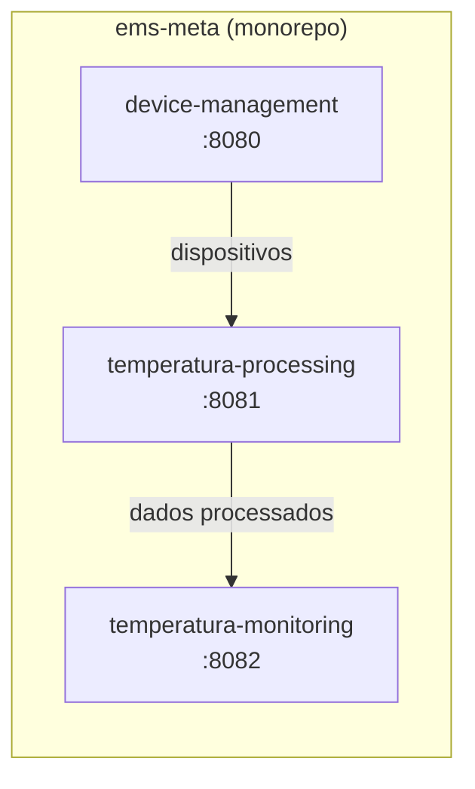

# EMS Meta

> Monorepo de microserviços do **EMS** (Energy Management System) — plataforma AlgaSensor para gestão e monitoramento de dispositivos IoT.

[](https://openjdk.org/)
[](https://spring.io/projects/spring-boot)
[](https://gradle.org/)

---

## Sobre o projeto

O **ems-meta** centraliza os microserviços do domínio EMS em um único repositório (**monorepo**).  
Cada serviço em `services/` é um projeto Spring Boot independente — com build, testes e deploy próprios — mas compartilha o mesmo versionamento e histórico Git.

### Visão geral da arquitetura



| Serviço | Responsabilidade | Porta | Caminho |
|---------|------------------|-------|---------|
| **device-management** | Cadastro e gestão de dispositivos | `8080` | [`services/device-management`](services/device-management) |
| **temperatura-processing** | Processamento de leituras de temperatura | `8081` | [`services/temperatura-processing`](services/temperatura-processing) |
| **temperatura-monitoring** | Monitoramento e alertas de temperatura | `8082` | [`services/temperatura-monitoring`](services/temperatura-monitoring) |

---

## Stack

| Tecnologia | Versão |
|------------|--------|
| Java | 17 |
| Spring Boot | 4.0.4 |
| Spring Data JPA | — |
| Spring Web MVC | — |
| H2 (dev) | — |
| Lombok | — |
| Gradle (wrapper) | incluído em cada serviço |

**Group ID:** `com.synki`  
**Namespace:** `com.synki.<nome_do_servico>`

---

## Pré-requisitos

- [JDK 17](https://adoptium.net/) ou superior
- Git

> Não é necessário instalar o Gradle — cada serviço inclui o wrapper (`./gradlew`).

---

## Início rápido

### 1. Clonar o repositório

```bash
git clone https://github.com/amaica/ems-meta.git
cd ems-meta
```

### 2. Executar um microserviço

```bash
cd services/device-management
./gradlew bootRun
```

Repita em terminais separados para subir os demais serviços:

```bash
cd services/temperatura-processing && ./gradlew bootRun   # porta 8081
cd services/temperatura-monitoring  && ./gradlew bootRun   # porta 8082
```

### 3. Verificar se está no ar

```bash
curl http://localhost:8080/actuator/health  # quando actuator estiver habilitado
```

---

## Build e testes

Dentro da pasta de qualquer serviço:

```bash
./gradlew build      # compila + testes
./gradlew test       # apenas testes
./gradlew bootJar    # gera JAR executável em build/libs/
```

---

## Estrutura do repositório

```
ems-meta/
├── services/
│   ├── device-management/
│   │   ├── src/main/java/com/synki/device_management/
│   │   ├── src/main/resources/application.properties
│   │   ├── build.gradle
│   │   └── gradlew
│   ├── temperatura-processing/
│   └── temperatura-monitoring/
└── README.md
```

Cada microserviço segue o layout padrão Spring Boot e pode ser aberto isoladamente no IntelliJ IDEA ou VS Code.

---

## Desenvolvimento

### Rodar todos os serviços localmente

Abra **um terminal por serviço**. As portas já estão configuradas para não conflitar:

| Serviço | `server.port` |
|---------|---------------|
| device-management | `8080` |
| temperatura-processing | `8081` |
| temperatura-monitoring | `8082` |

### Adicionar um novo microserviço

1. Crie uma nova pasta em `services/<nome-do-servico>/`
2. Inicialize com Spring Boot + Gradle (group `com.synki`)
3. Defina uma porta exclusiva em `application.properties`
4. Atualize esta tabela no README

---

## Por que monorepo?

| Abordagem | Vantagem |
|-----------|----------|
| **Monorepo** *(atual)* | Mudanças coordenadas, setup simples, visão unificada do sistema |
| **Repo por serviço** | Deploy e versionamento totalmente independentes por time |

Nesta fase o monorepo reduz a complexidade operacional. Um serviço pode ser extraído para repositório próprio no futuro sem alterar sua estrutura interna.

---

## Licença

Projeto interno **AlgaSensor / Synki**. Todos os direitos reservados.
